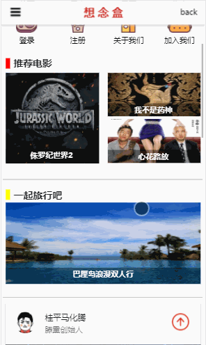
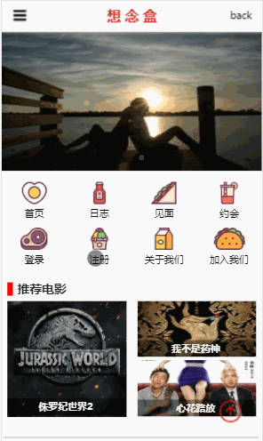
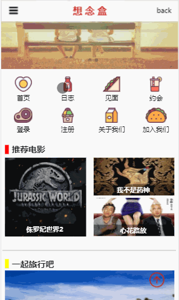
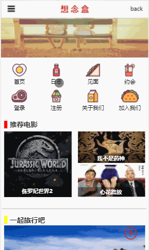

# VueProject-MissBox

> VUE项目-想念盒

## 项目构建

``` bash
# 依赖插件安装
npm install

# 项目运行
npm run dev

# 项目打包
npm run build

```
## 技术栈
> vue2 + MintUI + MuseUI + MUI + vue-router + webpack + ES6

## 项目介绍
想念盒WebApp旨在给异地情侣提供出行、娱乐以及资讯信息，针对异地相见提供最佳出行方案，为约会提供娱乐咨询以及分享经历和了解他人的经历。
## 效果展示
### 主页面

### 登录注册页面

### 日志页

### 出行页


#### 注：项目有待完善，现需后端技术支持上线，有意者请加我微信细聊。


#### PS：如果你也经历过异地恋，请给我一个star吧！经历过的人都懂！
